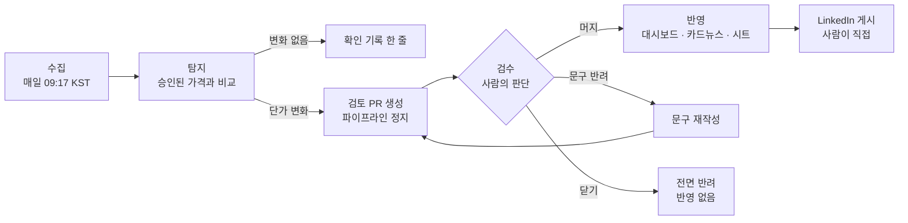

# README 확정 문안 (스크립트)

> **상태: 확정.** 2026-09-16 사용자 승인. 규칙 16에 따라 `README.md`보다 먼저 작성하고 `/humanize-korean` 점검을 거쳤다. **이 문서가 README 문안의 정본이다.** `README.md`의 문구가 이 문서와 다르면 이 문서를 따른다.
> **어조:** 결론을 앞에 두고 근거를 뒤에 둔다. 설명 문장은 합쇼체, 표 머리와 라벨은 명사구로 쓴다(규칙 17).
> **읽는 사람:** 저장소를 처음 여는 채용 담당자와 개발자. 프로젝트의 사전 정보가 없다.
> **강조점:** ① 자동화한 문제 ② 수집 → 탐지 → 검수 → 반영의 연결 ③ 검수 단계의 사람 개입

## 0. 고정값과 출처

README는 자동 생성물이 아니므로 자리표시자가 없다. 숫자는 아래 출처에서 옮겨 적은 고정값이다.

| 값 | 출처 | 확인 |
|---|---|---|
| 월 비용 표 24칸 | 2026-09-11 승인 스냅샷, `model/tco.estimate` 재계산 | 2026-09-16 [확인] |
| 최대 2.28배 | 소규모 BI · 미국 리전 Databricks $2,056 ÷ Redshift $900 | 2026-09-16 [확인] |
| 11.4% ~ 31.7% | 서울 리전 ÷ 미국 리전 월 비용, 워크로드 3개 × 플랫폼 4개 | 2026-09-16 [확인] |
| -3.8% ~ +35.7%, 39.5%p | `model/tco.seoul_premiums`, `t2_verdict` | 2026-09-16 [확인] |
| 가격 18개 | 승인 스냅샷 행 수 | 2026-09-16 [확인] |
| 테스트 142개 | `tests/` | 2026-09-16 [확인] |

**다음 승인 뒤 낡는 값:** 5절 전체. 기준일을 밝혀 두고, 최신 값은 대시보드로 안내한다.

## 1. 용어

| README 표기 | 쓰지 않는 표기 | 근거 |
|---|---|---|
| 월 비용 | 월 사용료 | 규칙 17. `월 사용료`는 카드에만 쓴다(D17) |
| 채택 / 기각 | 지지 / 판정 | 규칙 17 |
| 미국 리전 · 서울 리전 | 미국과 서울 | 규칙 17 |
| 서울 리전 단가 차이 | 서울 프리미엄 | D25 |
| 승인 / 반려 | 컨펌 | 공개 문안 기준(Phase 3 3-2) |
| 검수 | 검토 | 사용자가 제시한 4단계 이름. 산출물 이름(검토 PR, 검토 보고서)은 그대로 둔다 |
| 워크로드 이름(소규모 BI 대시보드 등) | W1·W2·W3 | D24. 기호는 처음 보는 독자에게 뜻이 전달되지 않는다 |

## 2. 문안

````markdown
# consumption-insights

데이터 플랫폼 네 곳의 가격을 매일 수집해 같은 워크로드의 월 비용으로 환산합니다.
가격이 바뀐 날에는 검토 요청을 열고 정지합니다.
사람이 승인한 값만 대시보드와 기록에 반영합니다.

**[대시보드](https://eugeejo-ui.github.io/consumption-insights/)** · **[소개 카드뉴스](https://eugeejo-ui.github.io/consumption-insights/cards/intro/cards.pdf)**

> 모든 금액은 약정 할인을 제외한 모델 추정치입니다. 가정과 계산 과정, 원본 가격을 모두 공개합니다.

## 요약

| 항목 | 내용 |
|---|---|
| 비교 대상 | Snowflake · Databricks · BigQuery · Redshift, 미국 리전 · 서울 리전 |
| 자동화한 일 | 가격 수집, 월 비용 환산, 변동 탐지, 검토 자료·카드뉴스·게시문 생성, 승인 후 게시와 기록 |
| 사람이 맡는 일 | 공개 여부 판단, 약관상 자동 접근이 금지된 가격표 확인, LinkedIn 게시 |
| 핵심 설계 | 파이프라인은 검토 요청을 연 뒤 정지합니다. 승인이 있어야 다음 단계가 진행됩니다 |

## 1. 해결한 문제

### 과금 단위가 달라 가격표만으로는 비교할 수 없습니다

네 플랫폼은 크레딧, DBU-시간, 슬롯-시간, RPU-시간으로 과금합니다.
단가를 나란히 놓아도 어느 플랫폼이 저렴한지 알 수 없습니다.
이 프로젝트는 같은 워크로드를 가정해 월 비용으로 환산합니다.

### 가격은 예고 없이 바뀝니다

네 플랫폼의 두 리전 가격을 사람이 매일 확인하는 것은 반복 작업입니다.
수집, 비교, 변동 정리, 게시물 작성까지를 자동화했습니다.

### 자동 생성물을 그대로 공개하면 오류도 함께 공개됩니다

수집 오류, 잘못된 숫자, 어색한 문구는 게시된 뒤에 바로잡기 어렵습니다.
그래서 생성은 자동으로 하고 공개 여부는 사람이 결정합니다.

### 약관이 자동화의 경계를 정합니다

Snowflake와 Databricks의 웹사이트 약관은 자동 모니터링을 금지합니다.
LinkedIn 약관은 자동 게시를 금지합니다.
이 영역은 알림과 사람의 작업으로 대신합니다.

## 2. 전체 흐름: 수집 → 탐지 → 검수 → 반영



| 단계 | 하는 일 | 다음 단계로 넘어가는 조건 |
|---|---|---|
| 수집 | 가격 18개를 받아 날짜별 스냅샷으로 저장합니다 | 수집기 세 개가 모두 성공 |
| 탐지 | 마지막으로 승인한 스냅샷과 단가를 비교하고 월 비용을 다시 계산합니다 | 단가가 하나라도 바뀜 |
| 검수 | 검토 PR에서 사람이 자료를 확인하고 승인 여부를 정합니다 | **사람의 승인(머지)** |
| 반영 | 승인 기록을 남기고 대시보드, 카드뉴스, 변동 이력을 갱신합니다 | — |

## 3. 단계별 설명

### 3-1. 수집

| 플랫폼 | 가격 출처 | 방식 |
|---|---|---|
| Redshift | AWS 가격 파일 | 자동 수집 |
| Databricks | Azure Retail Prices API | 자동 수집 |
| BigQuery | 공식 가격 페이지 | 수동 가격표 + 페이지 변경 감지 |
| Snowflake | 서비스 소비표 | 수동 가격표 + 정기 확인 알림 |

- 수집기 세 개가 모두 성공한 날에만 스냅샷을 저장합니다. 일부만 저장된 스냅샷은 이후 비교를 오염시킵니다.
- 수동 가격표에 원본 확인일이 없으면 실행이 멈춥니다.
- BigQuery 가격 페이지는 하루 한 번 가격 문자열의 지문만 비교합니다. 지문이 바뀌면 확인 요청 Issue가 열립니다.
- Snowflake와 Databricks 웹사이트에는 자동으로 접근하지 않습니다. 수동 가격표의 확인일이 90일을 넘으면 확인 요청 Issue가 열립니다.

### 3-2. 탐지

- 비교 기준은 사람이 마지막으로 승인한 스냅샷입니다. 승인하지 않은 값은 기준으로 쓰지 않습니다.
- 변화가 없는 날은 확인 기록(`data/checks.csv`)에 한 줄만 남깁니다.
- 단가가 하나라도 바뀌면 검토 보고서와 변동 이벤트(`events.json`)를 만듭니다.
- 월 비용이 1% 이상 바뀌거나 순위가 바뀐 날에는 글 초안, 카드뉴스(PNG·PDF), LinkedIn 게시문을 함께 만듭니다.
- 판정 기준값은 데이터를 보기 전에 `config/thresholds.yaml`에 고정했습니다.

생성 단계는 아래 검사를 코드로 강제합니다. 하나라도 어긋나면 생성을 멈춥니다.

| 검사 | 기준 |
|---|---|
| 숫자 | 글, 카드, 게시문의 모든 숫자가 `events.json`에 있어야 합니다 |
| 누락 | 카드에 실린 변동 항목 수가 `events.json`의 항목 수와 같아야 합니다. 항목이 많으면 카드를 늘립니다 |
| 길이 | 게시문이 3,000자를 넘으면 멈춥니다 |
| 레이아웃 | 브라우저 실측으로 글자 겹침, 넘침, 줄 수를 확인합니다 |

### 3-3. 검수: 사람이 개입하는 단계

**파이프라인은 검토 PR을 연 뒤 정지합니다.** 사람이 판단하기 전에는 게시도 기록도 진행되지 않습니다.

| 순서 | 내용 |
|---|---|
| 알림 | 검토 PR이 열리면 저장소 소유자가 담당자로 지정되어 알림을 받습니다 |
| 확인 | PR 본문에서 검토 보고서, 글 초안, 카드뉴스 미리보기, 게시문을 함께 봅니다. GitHub 웹과 모바일에서 판단할 수 있습니다 |
| 결정 | 아래 세 가지 중 하나를 고릅니다 |

| 행동 | 의미 | 결과 |
|---|---|---|
| PR 머지 | 승인 | 반영 단계가 시작됩니다 |
| `revise-copy` 라벨 + 사유 코멘트 | 문구만 반려 | 재작성 요청 Issue가 열리고 게시가 보류됩니다 |
| PR 닫기 | 전면 반려 | 아무것도 반영되지 않습니다. 그 값은 비교 기준에서도 빠집니다 |

**문구 반려 흐름**

1. 라벨이 붙으면 워크플로가 재작성 요청 Issue를 열고 검토 브랜치에 보류 파일을 커밋합니다.
2. 보류 파일이 있는 동안에는 PR을 머지해도 승인과 게시가 거부됩니다.
3. Claude가 반려 사유를 반영해 문안을 다시 쓰고 같은 PR을 갱신합니다.
4. 사람이 다시 확인합니다. 자동 재작성은 3회까지입니다. 이후에는 사람이 직접 고칩니다.

반려 사유는 저장소 권한이 있는 사람의 코멘트에서만 읽습니다. 공개 저장소의 외부 입력이 재작성 지시로 들어가는 것을 막기 위해서입니다.

**사람이 개입하는 이유**

- 수집값이 정상인지는 원본 가격표와 대조해야 판단할 수 있습니다.
- 공개된 숫자와 문구는 되돌리기 어렵습니다.
- 승인한 값이 다음 비교의 기준이 됩니다. 검수를 건너뛰면 오류가 이후 비교에 누적됩니다.

### 3-4. 반영

아래 작업은 승인(머지) 뒤에만 실행됩니다.

1. 스냅샷에 승인 기록(`approved.txt`)을 남깁니다.
2. 대시보드를 다시 만들어 GitHub Pages에 게시합니다.
3. 그날의 카드뉴스와 게시문을 사이트의 `cards/<날짜>/`에 게시합니다.
4. 단가 변동 이력을 Google 스프레드시트에 적재합니다. 적재가 실패해도 게시는 계속됩니다. 실패는 Issue로 알립니다.
5. 사람이 카드 PNG와 게시문을 받아 LinkedIn에 직접 게시합니다.

- 시트 적재는 그 실행에서 새로 승인한 날짜에만 실행됩니다. 코드만 바뀐 날에는 같은 행이 다시 쌓이지 않습니다.
- 검증용 시뮬레이션 스냅샷은 머지되어도 승인이 거부됩니다.

## 4. 사람이 맡는 일

| 시점 | 할 일 |
|---|---|
| 가격이 바뀐 날 | 검토 PR에서 승인, 문구 반려, 전면 반려 중 하나를 고릅니다 |
| BigQuery 가격 페이지 변경 알림 | 원본을 확인하고 수동 가격표를 고칩니다 |
| 수동 가격표 확인 알림(90일) | Snowflake와 Databricks 가격표를 확인하고 확인일을 갱신합니다 |
| 승인 뒤 | 카드뉴스와 게시문을 LinkedIn에 직접 게시합니다 |

## 5. 현재 결과 (2026-09-11 승인 스냅샷 기준)

**같은 워크로드에서도 플랫폼 간 월 비용이 최대 2.28배 차이 납니다.**
최신 값은 [대시보드](https://eugeejo-ui.github.io/consumption-insights/)에 있습니다.

월 비용(USD, 월 비용이 낮은 순서)

| 워크로드 | 미국 리전 | 서울 리전 |
|---|---|---|
| 소규모 BI 대시보드<br/>소형 1대, 월 220시간 | Redshift 900 · Snowflake 1,550 · BigQuery 1,693 · Databricks 2,056 | Redshift 1,032 · Snowflake 2,032 · BigQuery 2,167 · Databricks 2,708 |
| 야간 배치 ETL<br/>소형 2대, 월 60시간 | Redshift 600 · Snowflake 950 · BigQuery 1,093 · Databricks 1,216 | Redshift 681 · Snowflake 1,222 · BigQuery 1,402 · Databricks 1,568 |
| 비정기 대용량 탐색<br/>월 20TiB 스캔 | Redshift 360 · Snowflake 470 · BigQuery 498 · Databricks 544 | Redshift 401 · Snowflake 574 · BigQuery 634 · Databricks 656 |

- 서울 리전의 월 비용은 미국 리전보다 11.4%에서 31.7% 높습니다.
- 서울 리전 단가 차이는 항목마다 -3.8%(Databricks 스토리지)에서 +35.7%(Databricks 서버리스 SQL)까지 벌어집니다.

**검증한 질문**

| 질문 | 결과 |
|---|---|
| 워크로드에 따라 월 비용 1위 플랫폼이 달라지는가 | **기각.** 두 리전의 세 워크로드 모두 Redshift가 1위입니다. 미국 리전은 용량 가정을 ±50% 조정하면 1위가 바뀝니다. 서울 리전은 1위가 유지됩니다 |
| 서울 리전 단가 차이는 서비스마다 다른가 | **채택.** 단가 차이의 최댓값과 최솟값이 39.5%p 벌어져 기준(10%p)을 넘습니다 |

## 6. 모델 가정과 한계

| 항목 | 가정 |
|---|---|
| 소형 1대 | Snowflake 시간당 2크레딧, Databricks 시간당 12 DBU, Redshift 8 RPU, BigQuery 100슬롯 |
| 스토리지 | 압축 후 10TB |
| 제외 항목 | 네트워크 송출, 무료 구간, 최소 과금 단위, 약정 할인 |
| 통화 | 벤더가 공시한 미국 달러. 원화로 환산하지 않습니다 |

- 소형 1대의 기준은 벤더의 크기 이름입니다. 플랫폼 간 성능이 같은지는 검증하지 않았습니다.
- Redshift의 우위는 "8 RPU = 소형 1대" 가정에 크게 의존합니다. BigQuery 실측으로 보정할 예정입니다.
- 서울 리전 단가 차이의 판정 기준(10%p)은 초기 수치를 본 뒤 정했습니다. 기준을 사전에 고정한다는 원칙의 예외이므로 함께 공개합니다.
- 원화로 환산하면 환율 변동이 가격 변동으로 탐지됩니다. 그래서 공시 통화를 그대로 씁니다.

## 7. 설계 원칙과 안전장치

| 원칙 | 구현 |
|---|---|
| 승인 전에는 공개하지 않습니다 | 게시, 카드 공개, 시트 적재는 머지 이후 워크플로에서만 실행됩니다 |
| 승인한 값만 기준으로 씁니다 | 비교는 승인 기록이 있는 스냅샷끼리만 합니다 |
| 약관을 지킵니다 | Snowflake·Databricks 웹사이트 자동 접근과 LinkedIn API 호출이 없습니다. BigQuery 가격 페이지는 robots.txt를 확인하고 하루 한 번만 읽습니다 |
| 장기 비밀키를 두지 않습니다 | Google 인증은 서비스 계정 키 없이 워크로드 아이덴티티 연동으로 처리합니다 |
| 외부 코드 변경에 대비합니다 | 모든 GitHub Actions를 커밋 SHA로 고정합니다. 작업마다 최소 권한만 줍니다 |
| 정보를 생략하지 않습니다 | 변동 항목이 많으면 카드 장수를 늘립니다 |

## 8. 진행 현황

| 단계 | 내용 | 상태 |
|---|---|---|
| Phase 0 | 데이터 소스, 약관, 플랫폼 제약 점검 | 완료 |
| Phase 1 | 가격 수집, 월 비용 모델, 대시보드, 중간 검토 정지점 | 완료 |
| Phase 2 | 매일 자동 수집, 변동 탐지, 검토 PR, 게시, 시트 적재 | 완료 |
| Phase 3 | 카드뉴스·게시문 자동 생성, 문구 반려 흐름, 변동 알림, 첫 LinkedIn 게시 | 완료 |
| Phase 4 | 실적 공시 코너, BigQuery 실측 비용 실험 | 예정 |
| Phase 5 | 운영 안정화, 운영 점검표 | 예정 |

자동 테스트 142개가 있습니다.

## 9. 저장소 구조

```
collectors/          가격 수집기(AWS, Azure, 수동 가격표)
model/               월 비용 계산, 가설 판정
detect/              변동 탐지, 가격 페이지 지문 비교
publish/             대시보드·검토 보고서·카드뉴스·게시문 생성, 시트 적재
templates/           대시보드, 카드뉴스, 글 템플릿
config/              판정 기준값
data/raw/            날짜별 가격 스냅샷과 검토 자료
data/manual/         수동 가격표, 워크로드 가정
.github/workflows/
  collect.yml        매일 수집·탐지·검토 PR
  watch.yml          가격 페이지 감시, 확인 알림
  revise.yml         문구 반려 처리
  publish.yml        승인 뒤 게시·적재
docs/                계획, 결정 기록, 과제별 실행 기록
```

## 10. 로컬 실행

```bash
python -m venv .venv
.venv/Scripts/python -m pip install -r requirements.txt   # macOS·Linux: .venv/bin/python

python pipeline.py --dry-run          # 파일을 쓰지 않고 오늘 가격과 결과만 확인
python pipeline.py                    # 수집·탐지 후 검토 자료를 만들고 정지
python pipeline.py --confirm <날짜>   # 검토한 스냅샷을 승인하고 대시보드 생성
python -m pytest
```

카드뉴스를 만들려면 Chrome 또는 Edge와 한글 글꼴(Noto Sans KR 권장)이 필요합니다.

## 11. 기술 스택

Python 3.11 · requests · PyYAML · Jinja2 · google-auth · pytest · GitHub Actions · GitHub Pages · Google Sheets API · 헤드리스 Chrome/Edge

## 12. 문서

| 문서 | 내용 |
|---|---|
| [`CLAUDE.md`](CLAUDE.md) | 전체 진행 기록, 작업 규칙, 결정 로그. Claude Code와 함께 개발하며 사용한 기준 문서입니다 |
| [`docs/01_plan_v2.md`](docs/01_plan_v2.md) | 설계 근거 |
| [`docs/phases/`](docs/phases/) | 단계별 진행계획과 결과 |
| [`docs/tasks/`](docs/tasks/) | 과제별 세부 계획과 실행 기록 |
| [`docs/scripts/`](docs/scripts/) | 자동 생성 문안의 정본 |
| [`docs/security/`](docs/security/) | 보안 점검 기록 |
````

## 3. `/humanize-korean` 점검 기록

### run `2026-09-16-013` (2026-09-16, 초안 점검)

| 항목 | 결과 |
|---|---|
| 경로 | light (route_hint, risk_band low, risk_score 1) |
| 입력 | 2절 문안 8,177자, 장르 report |
| 변경률 | **0.2%** (게이트 P0), 문장 터치율 2.9%(7/242) |
| 구조 게이트 | exit 0 수렴. 수치 주입·각주·인용·register 이상 없음. 서법 소실 0문장 |
| 자체검증 | 6/6 통과 |
| 보존 확인 | 숫자·백틱 코드·URL·코드 블록 3개·헤딩 순서·표 행 수·고정 용어 출현 횟수가 원문과 같다 |

**반영한 수정 (스킬 7건)**

| 위치 | 수정 |
|---|---|
| 1절 자동 생성물 문단 | 연결어미 뒤 쉼표 제거 |
| 3-3 문구 반려 흐름 1·3번 | 연결어미 뒤 쉼표 제거 |
| 3-3 문구 반려 흐름 4번 | `3회까지이며,` → 두 문장으로 분리 |
| 3-4 반영 4번 | `게시는 계속되고, Issue로 실패를 알립니다` → `게시는 계속됩니다. 실패는 Issue로 알립니다.` 주어 불일치 해소 |
| 5절 검증한 질문 1행, 7절 안전장치 표 | 연결어미 뒤 쉼표 제거 |

**Claude 추가 수정 (3건)**

| 위치 | 수정 | 근거 |
|---|---|---|
| 5절 검증한 질문 1행 | `1위가 바뀌고 서울 리전은` → 두 문장으로 분리 | 규칙 16 한 문장 한 사실. 쉼표 제거 뒤 두 리전의 결과가 한 문장에 남았다 |
| 7절 안전장치 표 | `고정하고 작업마다` → 두 문장으로 분리 | 같은 이유 |
| 5절 검증한 질문 2행 | `최대값과 최소값` → `최댓값과 최솟값` | 표준 맞춤법(사이시옷). 스킬 보고 |

**유지한 것:** 콜론 부제 헤딩 2개(절 제목), 관형절 중첩 2곳(읽기에 지장 없음), 합쇼체 종결 연속(지정 어조).
